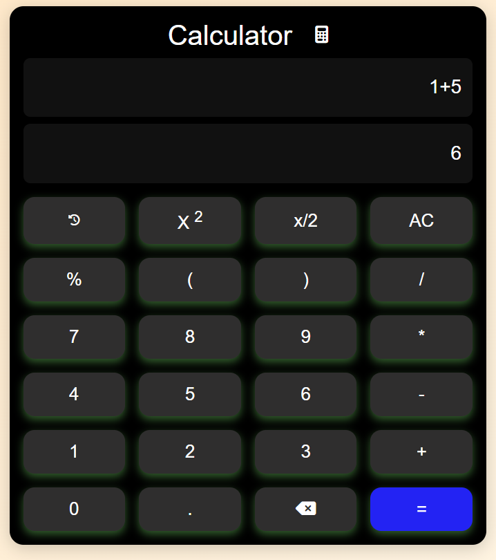
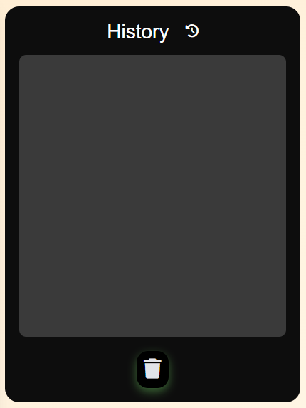

# 🧮 Calculator App

A **responsive web-based calculator** that performs basic arithmetic and special functions, complete with a history panel for tracking previous calculations.

<!-- <div align="center" style="margin-bottom: 20px;">
  
  
</div> -->

---

## 🚀 Features

- **Basic Operations:** Addition, subtraction, multiplication, division  
- **Special Functions:** Square (`x²`), half (`x/2`), percentage (`%`)
- **History Panel:** Stores and displays past calculations
- **Convenient Controls:**  
  - `AC` – Clear current input/result  
  - `Backspace` – Delete last input character  
  - `Trash` – Clears the entire history  
- **Keyboard Support:**  
  - `Enter` → Calculate & save result  
  - `Backspace` → Delete last character  
  - `Escape` → Clear input  
  - `Delete` → Clear history  
- **Responsive Design** for desktop, tablet, and mobile
- **Smooth Animations** for interactive UI
- **Modern, Minimal Interface**

---

## 📸 Demo

<div align="center">
  
  
</div>

---

## 🛠️ Technologies Used

- **HTML5** – App structure & markup
- **CSS3** – Styling, grid layout, media queries, button effects
- **JavaScript** – Calculator logic and history management
- **Font Awesome** – Feature and control icons

---

## 📁 Folder Structure

```
calculator-app/
├── calc.css         # Styles
├── calc.js          # Logic
├── index.html       # Main HTML
├── images/          # Images & screenshots
└── README.md
```

---

## 📱 Responsive Layout

- **Desktop:** Calculator & history panel side-by-side
- **Tablet:** Adaptive and height-adjusted layout
- **Mobile:** Optimized buttons, responsive panel, easy history scrolling

---

## 🧭 Usage

1. **Clone the repository:**
   ```sh
   git clone https://github.com/Devkaran-Patidar/Calculator.git
   ```
2. **Open `index.html` in your browser**
3. **Start calculating!**

---

## 🚧 Future Improvements

- [+] **Scientific Functions**: sin, cos, tan, log, etc.
- [+] **Dark/Light Themes**
- [+] **Persistent History** with `localStorage`
- [+] **Enhanced mobile UX** with sliding panels

---

## 📄 License

Open-source. Free to use and adapt.

---

> Created by [Devkaran Patidar](https://github.com/Devkaran-Patidar)
